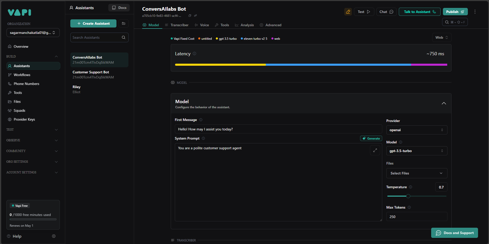

# Voice Agent API - Unified Interface for AI Voice Agents

## Overview

The Voice Agent API provides a unified interface for creating AI voice agents across multiple platforms, currently supporting Vapi.ai and Retell.ai. It simplifies the process of agent creation by standardizing the request format and handling platform-specific requirements.

## Features

- **Single API Endpoint** for both Vapi and Retell platforms
- **Automatic LLM Configuration** for Retell agents
- **Consistent Response Format** across different providers
- **Environment-Based Configuration** for easy deployment
- **Error Handling** with standardized error responses

## Dashboard (Vapi)


## API Documentation

### Base URL

```
https://voice-agent-wlw1.onrender.com
```

### Endpoints

#### Create Agent

**POST /create-agent**

Creates a new voice agent on the specified platform.

**Request Body:**

```json
{
  "provider": "vapi|retell",
  "agent_data": {
    // Platform-specific configuration
  }
}
```

**Parameters:**

- `provider` (required): Either "vapi" or "retell"
- `agent_data` (required): Configuration specific to the provider

### Usage Examples

#### 1. Create a Vapi Agent

```bash
curl -X POST "https://voice-agent-wlw1.onrender.com/create-agent" \
-H "Content-Type: application/json" \
-d '{
    "provider": "vapi",
    "agent_data": {
        "name": "Customer Support",
        "model_provider": "openai",
        "model_name": "gpt-3.5-turbo",
        "system_prompt": "You are a helpful customer support agent",
        "voice": {
            "provider": "11labs",
            "voiceId": "21m00Tcm4TlvDq8ikWAM"
        },
        "first_message": "Hello! How can I help you today?"
    }
}'
```

#### 2. Create a Retell Agent

```bash
curl -X POST "https://voice-agent-wlw1.onrender.com/create-agent" \
-H "Content-Type: application/json" \
-d '{
    "provider": "retell",
    "agent_data": {
        "name": "My Retell Agent",
        "system_message": "You are a helpful customer service assistant",
        "initial_message": "Hello! How can I assist you today?",
        "s2s_model": "gpt-4o-realtime",
        "temperature": 0.7,
        "voice_id": "11labs-michael",
        "language": "en-US"
    }
}
}'
```

### Response Format

**Successful responses for vapi** will return the agent details in a standardized format:

```json
{
    "createdAt": "2025-04-26T09:23:38.729Z",
    "firstMessage": "Hello! How may I assist you today?",
    "id": "b31f79d6-980e-4ef0-aa18-cc3f54abfe4b",
    "isServerUrlSecretSet": false,
    "model": {
        "model": "gpt-3.5-turbo",
        "provider": "openai",
        "systemPrompt": "You are a polite customer support agent",
        "temperature": 0.7
    },
    "name": "Test1",
    "orgId": "1f1aa301-8b5a-4aea-973b-b9b5388c66cf",
    "updatedAt": "2025-04-26T09:23:38.729Z",
    "voice": {
        "provider": "11labs",
        "voiceId": "21m00Tcm4TlvDq8ikWAM"
    }
}
```

**Error responses** follow this format:

```json
{
    "error": "string",
    "details": "string"  // optional
}
```

## Setup Instructions

### Clone the repository

```bash
https://github.com/sagarmanchakatla/voice-agent.git
cd voice-agent
```

### Install dependencies

```bash
pip install -r requirements.txt
```

### Configure environment variables

Create a `.env` file with your API keys:

```
VAPI_API_KEY=your_vapi_key
RETELL_API_KEY=your_retell_key
```

### Run the application

```bash
python main.py
```

## Deployment

The API can be deployed to any Python-compatible hosting service. We recommend:

- **Render.com**

## Troubleshooting

### Agent creation fails

- Verify your API keys are correct
- Check the provider's API status
- Ensure all required fields are included

### Environment variables not loading

- Confirm the `.env` file is in the root directory
- Restart your application after making changes

## Support

For any issues or support, please contact **sagarmanchakatla01@gmail.com**.